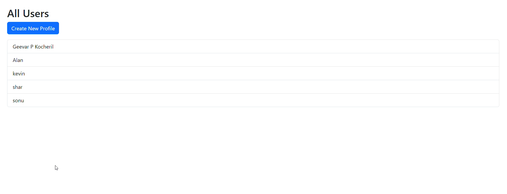

# 💼 Portfolio Manager Web Application

A **Portfolio Management System** built using **Spring Boot** and **Spring Tool Suite (STS)**.  
This web application allows users to create and manage professional profiles with support for adding **projects**, **skills**, and **achievements**.  
All data is stored and retrieved from a connected **database** through backend integration.

---

## 🖼️ Project Screenshots

### 🧾 Create New Profile Page
)

### 👥 List of All Users
 


### 🧠 Add Projects, Skills & Achievements


---

## 🚀 Features

- ✏️ **Add New Profiles** — Create user profiles with personal details like name, email, education, experience, and contact.
- 📋 **List All Users** — View all registered profiles in a clean tabular view.
- 💡 **Add Projects, Skills, and Achievements** — Each user can update their portfolio with multiple entries.
- 🗄️ **Database Connectivity** — Integrated with MySQL (or any relational DB) using JPA/Hibernate.
- 🌐 **Web Interface** — Developed with Spring Boot + Thymeleaf templates for smooth user interaction.
- ⚙️ **CRUD Operations** — Fully supports Create, Read, Update, and Delete operations.
- 🧩 **Scalable Architecture** — MVC pattern using Controllers, Services, Repositories, and Models.

---

## 🧠 Tech Stack

| Layer | Technology |
|:------|:------------|
| **Frontend** | HTML, CSS, Bootstrap, Thymeleaf |
| **Backend** | Java, Spring Boot, Spring MVC |
| **Database** | MySQL |
| **IDE** | Spring Tool Suite (STS) |
| **Build Tool** | Maven |

---

## ⚙️ Setup Instructions

### 1️⃣ Clone the Repository
```bash
git clone https://github.com/<your-username>/<your-repo-name>.git
cd <your-repo-name>
# PortfolioManager


